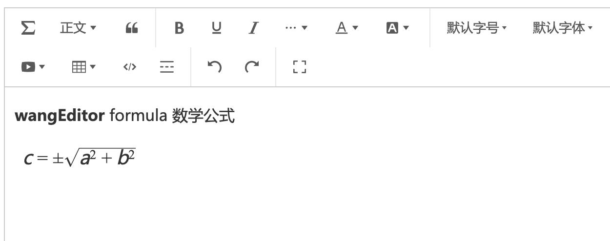

# wangEditor 图片来源

## 介绍

[wangEditor](https://www.wangeditor.com/) 公式插件，使用 [LateX](https://baike.baidu.com/item/LaTeX/1212106) 语法。



## 安装

```shell
yarn add katex
yarn add @wangeditor/plugin-image-source
```

## 使用

### 注册到编辑器

```js
import { Boot, IEditorConfig, IToolbarConfig } from '@wangeditor/editor'
import formulaModule from '@wangeditor/plugin-image-source'

// 注册。要在创建编辑器之前注册，且只能注册一次，不可重复注册。
Boot.registerModule(formulaModule)
```

### 配置

```js
// 编辑器配置
const editorConfig: Partial<IEditorConfig> = {
  // 选中公式时的悬浮菜单
 hoverbarKeys: {
    'image-source': {
      menuKeys: [
        'editImageSource',
        'deleteImageSource',
        'viewImageSourceLink',
        'imageSourceWidth30',
        'imageSourceWidth50',
        'imageSourceWidth100',
      ],
    }
  },

  // 其他...
}

// 工具栏配置
const toolbarConfig: Partial<IToolbarConfig> = {
  config: {
    insertKeys: {
      index: 1,
      keys: ['insertImageSource'],
    },
  },
  // 其他...
}
```

然后创建编辑器和工具栏，会用到 `editorConfig` 和 `toolbarConfig` 。具体查看 wangEditor 文档。

### 显示 HTML

获取的 HTML 格式如下

```html
<div 
  data-w-e-type="image-source"
  data-w-e-is-void
  data-w-e-is-inline
  data-src="https://himg.bdimg.com/sys/portrait/item/public.1.d5687a4f.U-Oa-nIwRRoeMouAR9Fpwg.jpg"
  data-alt="https://himg.bdimg.com/sys/portrait/item/public.1.d5687a4f.U-Oa-nIwRRoeMouAR9Fpwg.jpg"
  data-href="https://himg.bdimg.com/sys/portrait/item/public.1.d5687a4f.U-Oa-nIwRRoeMouAR9Fpwg.jpg"
  data-source="图片来源"
  style="width: 100px;"
>
  <div class="image-source">图片来源</div>
</div>
```

其中 `data-value` 就是 LateX 格式的值，可使用第三方工具把 `<span>` 渲染成公式卡片，如 [KateX](https://katex.org/)。

## 其他

不支持 i18n 多语言
